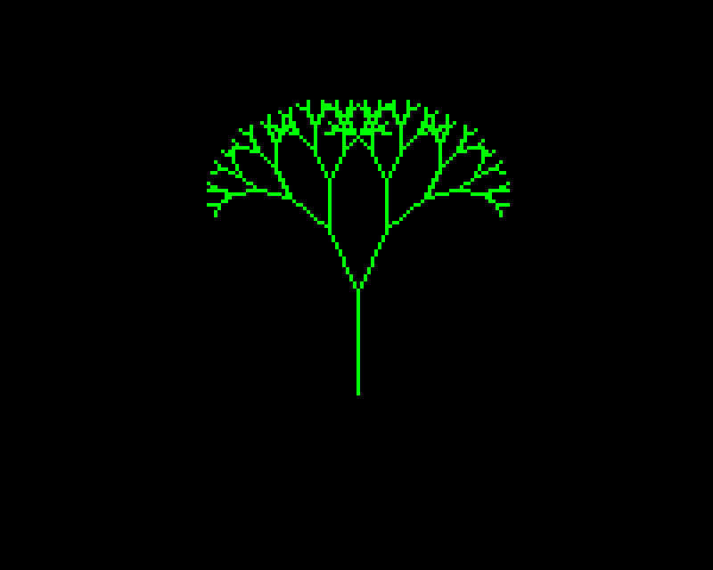
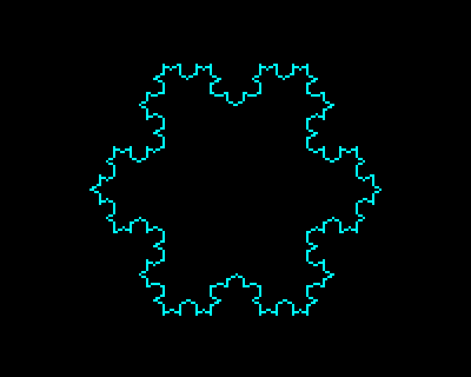
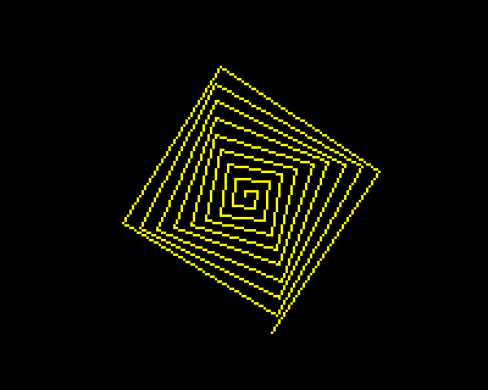
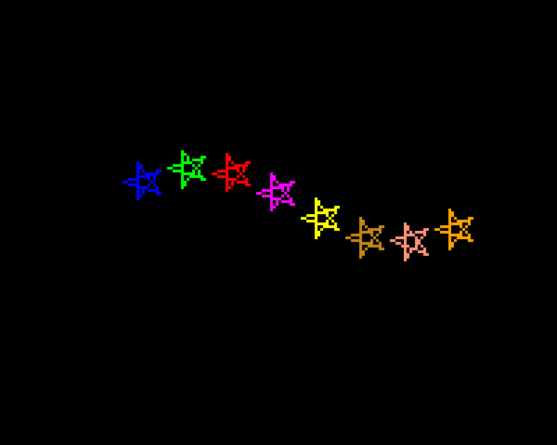
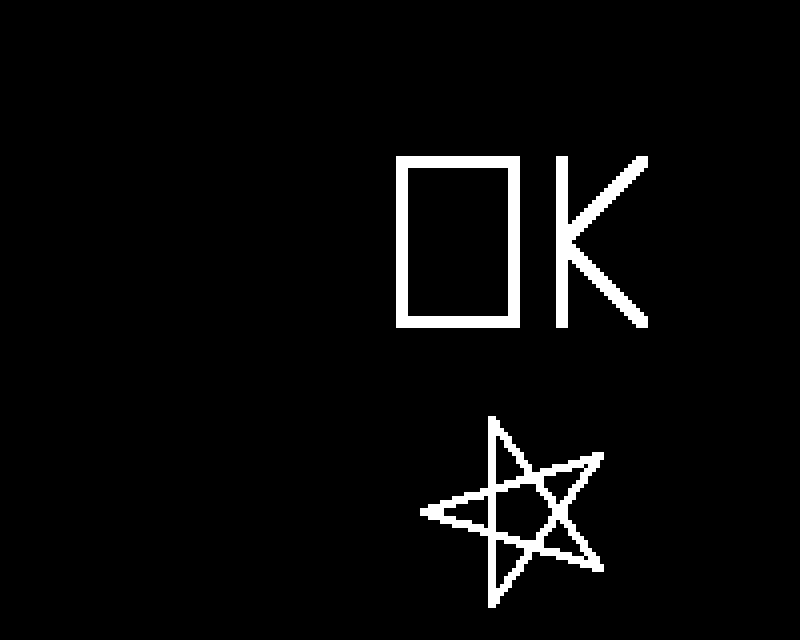
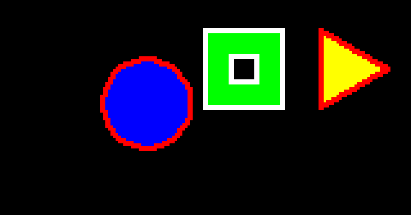

# Terminal Logo Turtle

<!-- Project metadata for the Quests project tools. GitHub does not show this block.
**Keywords:** termlogo, Logo interpreter, turtle graphics, UCBLogo, Terrapin Logo, terminal REPL, multi-line command editing, Braille graphics, Kitty graphics, Ghostty, 3D-printable stencil, STL, FILL and FILLED cut-outs, Pyodide browser version, Homebrew formula, SVG export, RGBA colours, tail recursion, animation, Python
**Status:** Active (v1.1.0; as at 2026-10-07)
**Start Date:** 2026-10-06
**Last Updated:** 2026-10-07
**Repository:** https://github.com/andybateman/termlogo (public)
-->

## Overview
A Logo interpreter with turtle graphics that runs entirely in the terminal. Python's built-in `turtle` needs a Tk window and PythonTurtle needs wxPython, so neither works over SSH or in a plain terminal. This one draws with Unicode Braille characters (2x4 dots per cell) in 24-bit colour, uses only the Python standard library (Python 3.10 or later), and follows UCBLogo behaviour by default. A selectable Terrapin colour mode supports its colour tutorial without changing existing programs.

**Try it in your browser, with nothing to install: <https://www.andybateman.com/termlogo/>** (see [Browser version](#browser-version)).

## Usage
```bash
./bin/termlogo                      # interactive REPL (canvas above, text log below)
./bin/termlogo examples/tree.logo   # run a file, print the canvas
./bin/termlogo -e 'repeat 36 [fd 30 rt 100]'
./bin/termlogo prog.logo -i         # continue in the REPL with the same workspace/picture
./bin/termlogo prog.logo -o out.svg # export (.svg, .png, .txt or .stl)
./bin/termlogo examples/flower.logo  # watch it draw (default speed 5)
./bin/termlogo examples/flower.logo --speed 0 # draw instantly
./bin/termlogo --render half         # braille | half | kitty | auto
./bin/termlogo --colour-mode terrapin # Terrapin tutorial colours and RGBA
./bin/termlogo prog.logo --fit 1000  # textbook programs: a 1000x1000 window fits the canvas
python3 -m unittest discover -s tests
```
**Homebrew:** the formula lives in this repository, so tap it by URL and install:
```bash
brew tap andybateman/termlogo https://github.com/andybateman/termlogo
brew trust --formula andybateman/termlogo/termlogo   # newer Homebrew refuses untrusted taps
brew install termlogo
```
It installs the source with Homebrew's Python 3.13 and a `termlogo` launcher. Each release needs `Formula/termlogo.rb` updated with the new tag URL and `sha256` (`curl -sL <tarball URL> | shasum -a 256`).

**Single file:** `tools/build_pyz.sh` writes `dist/termlogo.pyz`, one 220 KB executable that runs anywhere Python 3.10 or later is installed, with no source tree or install: `./termlogo.pyz examples/flower.logo`, or copy it onto your `PATH` as `termlogo`. Release pages carry a prebuilt copy (attach it with `gh release upload vX.Y.Z dist/termlogo.pyz`). It still needs Python; it is not a standalone binary.

Options: `--render`, `--speed 0-10` (default 5; 0 draws instantly), `--colour-mode`/`--color-mode ucblogo|terrapin` (default `ucblogo`), `--stencil-opt KEY=VALUE`, `--size COLSxROWS`, `--scale S` (pixels per turtle step, default 1; use 0.5 for drawings built for a 400x400 screen), `--fit N` (scale so an N x N Logo window fits the canvas; see below), `--no-color`/`--no-colour`, `--no-canvas`. REPL: Tab completes names, history is kept in `~/.termlogo_history`, `BYE` or Ctrl-D leaves.

Inside the REPL, `HELP` lists every command by category, `HELP fd` or `HELP "turtle` explains one, and Tab completes command names, your own procedures and `:variables`. `PRINT VERSION` (or `--version`) shows the version and author.

**Renderers** (`--render`, or `TERMLOGO_RENDER`; `auto` is the default):
- `kitty`: one real-pixel image per frame with anti-aliased lines, for terminals that speak the Kitty graphics protocol (Ghostty, Kitty, WezTerm). `auto` picks it when the terminal reports its pixel size; it is not used inside tmux or screen.
- `half`: solid half-block characters, 1x2 pixels per cell. Works in any terminal and has no gaps, but is a quarter of Braille's resolution.
- `braille`: 2x4 dots per cell. The most detail without graphics support, but lines look dotted.

A drawing keeps the same physical size in every renderer (one step is half a cell wide). In the Braille and half-block renderers the pen is a round brush as wide as `SETPENSIZE` (without anti-aliasing); Kitty paints anti-aliased, round-capped strokes.

**Speed and input:** `SETSPEED 0-10` (or `--speed`) lets you watch it draw. The default is 5; 0 is instant and each step doubles the speed. Piped runs and exports do not animate, but `SPEED` still reports the chosen setting. Moves, turns and arcs are paced, with redraws at up to about 30 frames a second. Escape or Ctrl-C stops the current program, including `WAIT` and loops; at the prompt it cancels the input line. On macOS/Linux in a mouse-reporting terminal, click or left-drag on the canvas to reposition the turtle, including while idle. During drawing, its current movement ends there without drawing a connector, and the next Logo command continues from that point.

The macOS/Linux command pane accepts cursor keys, Home/End, Backspace/Delete, Tab completion and Up/Down history (see the key table below). It grows to display the whole command: source newlines occupy separate rows, and long lines wrap without changing the source. The startup version, help and mouse-selection guidance stays visible until the first command starts running, including while typing an unfinished multi-line command. Blank lines, comments and cancelled input do not dismiss it. Extra command rows use the output area first, then temporarily reduce the canvas; the picture is restored when editing ends. Commands taller than the terminal scroll to keep the editing cursor visible. `--size` still keeps a fixed canvas.

**Up recalls a complete submitted command**, including an entire multi-line `REPEAT` block or `TO ... END` definition. Down restores your unfinished draft. A recalled multi-line command can be edited in place from the keyboard:

| Key | In the command pane |
|---|---|
| Up, Down | Move between the lines of a multi-line command. From its first or last line, step through history |
| Ctrl-P, Ctrl-N or PageUp, PageDown | Always step through history, whatever line the cursor is on |
| Alt+Enter (Option+Enter) | Add a line break at the cursor. Shift+Enter does the same in terminals that report it, such as Ghostty and Kitty |
| Enter | Run the command, wherever the cursor is |
| Home, End (Ctrl-A, Ctrl-E) | Start or end of the current line; press again for the start or end of the whole command |
| Ctrl-U, Ctrl-K | Delete to the start or end of the current line |

Edits to a recalled command are kept while you look at other history entries, until you run something. Stored history is only changed by what you run. In macOS Terminal, Option+Enter needs "Use Option as Meta key" switched on.

Click any visible command row to edit it, including earlier continuation lines; this does not move the turtle. Mouse positions follow wrapping and window resizing. Canvas clicks and terminal resizes preserve your draft. `READWORD` and `READLIST` use the same mouse-aware input handling. History is saved as versioned JSON in `~/.termlogo_history`; older readline history files still load, although their existing per-line entries remain separate. Long output is wrapped and paged in the REPL, so lists such as `COLOURS` can be read in full.

**Pasting a program:** in a bracketed-paste terminal such as Ghostty, a multi-line paste stays together in the editor. Press Enter to run it. Up then recalls the entire pasted program, including setup commands before a `REPEAT` block, rather than only the final block. Pasted tabs and line breaks are retained in the source; tabs are displayed as spaces. Commands entered separately remain separate history entries and can be reached with further Up presses.

**Text selection:** hold **Shift** while dragging to select terminal text, then use **Cmd+C** to copy on macOS. Ordinary clicks are reported to the app for canvas positioning and command editing; Ctrl-C still stops the program. Ghostty allows Shift-selection by default. If your configuration captures Shift-mouse too, `mouse-shift-capture = never` reserves it for native selection (see the [Ghostty reference](https://ghostty.org/docs/config/reference#mouse-shift-capture)).

### Terrapin tutorial colours
For the [Terrapin colour lesson](https://resources.terrapinlogo.com/weblogo/learning_center/colors), start with `./bin/termlogo --colour-mode terrapin`. The mode applies to scripts, exports and `-i` continuation too.

| Behaviour | UCBLogo mode (default) | Terrapin mode |
|---|---|---|
| Numbered colours | Original palette, initially 0-15 | Live WebLogo palette, 0-138; 138 is transparent |
| Colour names | Original Logo names | Web names, including both `grey` and `gray`, `aqua` and `fuchsia` |
| RGB inputs | `[r g b]`, components 0-100 | `[r g b]`, components 0-255; optional fourth alpha 0-1 |
| `PC` / `PENCOLOR`, `BG` / `BACKGROUND` | Original input | Always `[red green blue alpha]` |
| Standalone reporters | Use `PRINT` or `SHOW` | Values are printed, so `PC`, `BG` and `COLOURS` work on their own |
| `RANDOM n` | 0 through n-1 | 1 through n, matching the lesson's random-colour examples |

The indexed palette was checked against live WebLogo and its published RGB table (as at 2026-10-06). `COLOURS`/`COLORS` lists names in index order; `setpc random 138` selects indices 1-138, and `setpc (random 139)-1` includes 0. Some older manual examples are inconsistent: the live palette's gold is index 59, while 60 is goldenrod.

`SETPEN [penstate colour]` changes the pen state and colour together. Use the full words `PENUP`, `PENDOWN`, `PENERASE` or `PENREVERSE`; `PEN` reports that state. In Terrapin mode, `PD` returns to ordinary painting, and `FILL` only runs with the pen in `PENDOWN`. `(fill 0)` stops at differing colours, default `FILL` crosses pixels with alpha below 0.5, and `(fill 1)` fills the whole canvas.

Alpha is composited over existing strokes and the current background, preserved through resizing, and retained in PNG/SVG exports. `SETBG` does not alter existing artwork. `SETALPHA` changes the default alpha for subsequent pen colour inputs; explicit RGBA inputs override it, while background colours default to alpha 1. The initial Terrapin state is a black pen on transparent white. Terminal renderers display transparency against white when no opaque background is set.

For example, in Terrapin mode:
```logo
setpencolour [255 0 0 0.5]
pencolour
setpen [pendown royalblue]
setbg [240 248 255]
repeat 4 [fd 20 rt 90]
pu setxy 7 7 pd setpc "pink fill
background
colours
```

This is colour-focused compatibility, not a complete Terrapin interpreter. Browser undo controls, background images and patterns are not implemented. UCBLogo's `PALETTE` and `SETPALETTE` remain available only in UCBLogo mode.

**3D-printable stencil:** `STENCIL "plate` (or `(stencil "plate [thickness 1.6 margin 10])`, `SAVEPICT "plate.stl`, or `-o plate.stl`) turns the pen strokes into slots cut through a flat plate and writes a binary STL. `STENCIL` adds the `.stl` extension when the name lacks it; `SAVEPICT` and `-o` choose the format from the extension, so they need it. One step is 1 mm and pen size is the slot width (`SETPENSIZE 2` cuts 2 mm slots; fractions work). Parts that would fall out, such as the centre of an O, are tied back with bridges automatically. Options: `thickness 1.2`, `margin 8`, `bridge 1.6`, `bridges 2`, `width` (force every slot), `minwidth 0.8`, `plate [w h]`, `mirror true`, `pitch 0.2`, `mm 1`, `maxgap 15`. Try `termlogo examples/stencil_demo.logo -o demo.stl`. Slots narrower than 0.8 mm are widened, and islands smaller than 1 mm2 are filled in, with a warning for each. Text from `LABEL` and erased or reversed strokes are not part of the stencil.

**Filled areas are cut out.** `FILL` removes the whole area enclosed by the pen lines drawn before it, and `FILLED colour [instructions]` removes the shape the turtle traces, with the pen up or down. Anything left standing inside a cut-out is an island and is bridged like any other, up to `maxgap`. A `FILL` is left out, with a warning, when its area is not closed off by pen lines (on screen the canvas edge can bound a fill; on the plate nothing would) or when the turtle is sitting on a line. The fill colour makes no difference. Try `termlogo examples/stencil_fill.logo -o fill.stl`.

An 80x24 terminal gives the REPL a 160x64 pixel Braille canvas centred on (0,0), so coordinates run about -80..80 across and -32..32 up. The canvas follows terminal resizing, both at the prompt and while running a program. The scale, turtle state, strokes and labels are retained; artwork clipped by a smaller window reappears when it grows again. `--size` fixes the canvas dimensions. Larger terminals or `--scale` give more room. WINDOW mode (the default) lets the turtle roam off-screen, as in UCBLogo.

**Textbook coordinates:** programs written for a 1000x1000 Logo window run unchanged with `--fit 1000` (or `FITWINDOW 1000`), which scales the drawing so that window fits the canvas, whatever its size. The fit is kept when the terminal is resized. Pen sizes are in pixels and are not scaled by it. `--scale` and `SETSCALE` remain for choosing a fixed number of pixels per step.

## Gallery
Rendered with `./bin/termlogo examples/NAME.logo --speed 0 -o docs/images/NAME.png` (`tree` and `stencil_demo` add `--size 100x40` so the drawing is not clipped).

| | | |
|---|---|---|
| <br>`flower` | <br>`tree` | <br>`koch` |
| <br>`spiral` | <br>`stars` | <br>`stencil_demo` |
| <br>`stencil_fill` (FILL/FILLED cut-outs) | | |

## What works
- **Language:** `TO ... END` (with optional `[:x default]` and `[:rest]` inputs), variables scoped the Logo way, so a called procedure can see its caller's (`MAKE`, `LOCAL`, `LOCALMAKE`, `THING`, `NAME`, `GLOBAL`), infix operators `+ - * / ^ = <> < > <= >=` with Logo's unary-minus spacing rule, parenthesised variadic calls, `|word with spaces|`, comments, line continuation with `~`.
- **Control:** `REPEAT FOREVER REPCOUNT IF IFELSE TEST IFTRUE IFFALSE WHILE UNTIL DO.WHILE DO.UNTIL FOR STOP OUTPUT RUN RUNRESULT CATCH THROW ERROR WAIT BYE`, plus `FOREACH MAP FILTER FIND REDUCE APPLY INVOKE` with `?`/`?1`/`?2` slots, procedure names and `[[a b] body]` lambdas.
- **Data:** `WORD LIST SENTENCE FPUT LPUT COMBINE FIRST LAST BUTFIRST BUTLAST ITEM COUNT MEMBER REVERSE REMOVE REMDUP PICK ISEQ RSEQ UPPERCASE LOWERCASE CHAR ASCII` and the predicates (`EMPTYP LISTP WORDP NUMBERP MEMBERP EQUALP BEFOREP NAMEP PROCEDUREP PRIMITIVEP`).
- **Maths:** `SUM DIFFERENCE PRODUCT QUOTIENT REMAINDER MODULO INTQUOTIENT MINUS ABS INT ROUND SQRT POWER EXP LN LOG10 PI SIN COS TAN ARCTAN ARCSIN ARCCOS RANDOM RERANDOM AND OR NOT BITAND BITOR BITXOR ASHIFT` and the comparison words. Trig is in degrees.
- **Turtle:** `FD BK LT RT PU PD HOME CS CLEAN SETPOS SETXY SETX SETY SETH ARC DOT HT ST FILL FILLED LABEL WRAP WINDOW FENCE` (`FILLED` fills the polygon through the points the turtle visits and outlines it in the pen colour, as UCBLogo does), pen modes `PPT PE PX`, `SETPC SETBG SETPEN SETPENSIZE SETPALETTE`, and the queries `POS XCOR YCOR HEADING TOWARDS DISTANCE SHOWNP PENDOWNP PEN PENCOLOR/PENCOLOUR BACKGROUND WRAPP COLOURS/COLORS`. Colour inputs follow the selected mode described above. US and NZ spellings are accepted, including `SETPENCOLOR`/`SETPENCOLOUR` and `SETSCREENCOLOR`/`SETSCREENCOLOUR`.
- **Arrays:** `{a b c}` literals (and `{a b c}@0` for another origin), `ARRAY MDARRAY LISTTOARRAY ARRAYTOLIST ARRAYP SETITEM MDITEM MDSETITEM`, and `ITEM COUNT FIRST LAST PICK MEMBERP` also work on arrays. Arrays are shared, not copied, and equal only to themselves.
- **Property lists:** `PPROP GPROP REMPROP PLIST PLISTS PPS ERPS`. `ERALL` erases them too.
- **Workspace:** `PO POTS PONS ERASE ERALL DEFINE TEXT SAVE LOAD`, `PRINT TYPE SHOW READWORD READLIST`.
- **Files:** `OPENREAD OPENWRITE OPENAPPEND OPENUPDATE CLOSE CLOSEALL ALLOPEN SETREAD SETWRITE READER WRITER READPOS SETREADPOS WRITEPOS SETWRITEPOS EOFP FILEP ERASEFILE`. After `SETREAD`, `READWORD READLIST READCHAR READCHARS` read from the file, and after `SETWRITE`, `PRINT TYPE SHOW` write to it; `SETREAD []` and `SETWRITE []` go back to the keyboard and screen. Files still open when Logo ends are closed then.
- **Keys:** `READCHAR READCHARS KEYP`. In the REPL they take keys straight from the keyboard while a program runs (Enter gives a newline; Escape or Ctrl-C stops the program). Piped input is read a character at a time.
- **Text cursor:** `CURSOR`, `SETCURSOR [column row]`, `CLEARTEXT`. The REPL's text area under the canvas is five rows by the terminal's width, so `SETCURSOR` places text within those (counting from 0) and `PRINT` or `TYPE` then overwrite what is there. It lasts for one command; outside the REPL it is accepted and does nothing.
- **Jumps:** `GOTO "tag` and `TAG "tag` inside a procedure (also from within `IF`, `REPEAT` and other lists), and `.MAYBEOUTPUT`, which outputs its input if it made one and otherwise behaves like `STOP`.
- **Tail calls:** a final call in a procedure (also inside a final `IF`/`IFELSE`, or `OUTPUT proc ...`) runs as a loop, so `to loop ... loop end` runs indefinitely in constant memory. Escape or Ctrl-C stops it in the terminal. Other recursion is capped at 25,000 levels and then reports "Stack overflow".
- **Extensions:** `SETSCALE n` (same as `--scale`), `FITWINDOW n` (same as `--fit`), `SETSPEED`/`SPEED`, `STENCIL`, `SAVEPICT "file.svg|png|txt|stl`, `HELP`, `VERSION`.

## Browser version
The same Python engine runs in a web page through [Pyodide](https://pyodide.org/) (Python compiled to WebAssembly), in a Web Worker so a long drawing never freezes the page. It has an editor, a command line with history, an example menu, a speed control, a UCBLogo/Terrapin colour switch, and PNG, SVG and STL stencil downloads. Nothing is sent to a server.
```bash
python3 tools/build_web.py                 # builds dist/web (about 0.1 MB)
python3 -m http.server -d dist/web         # then open http://localhost:8000
```
Open it through a web server, not by double-clicking `index.html` (the page loads a module worker). Pyodide itself (about 12 MB) is loaded from the jsDelivr CDN on the first visit and cached by the browser after that. For a site that works offline or where the CDN is blocked, build with `--bundle-pyodide` (needs npm) to put a copy beside the page, or open the page with `?pyodide=https://...` to use another address. `docs/pages-workflow.yml` is a ready-made workflow for publishing this repository's own GitHub Pages instead (it has to be moved to `.github/workflows/` by someone whose token may push workflows).

**Live copy:** it is hosted at <https://www.andybateman.com/termlogo/>, as static files in the `andybateman/andybateman.github.io` repository. After you commit and push a change here, publish it with one command (it builds into the site checkout beside this one, commits and pushes; `--no-push` stops before pushing, and a path argument names a different site checkout):
```bash
tools/publish_site.sh
```
The page shows the version, commit and date it was built from under its title, and `https://www.andybateman.com/termlogo/config.json` holds the same, so you can tell at a glance whether the live copy is behind this repository. The build is reproducible: the same commit gives the same files, so publishing twice changes nothing.

**What it does:**
- Pictures are sent as the rows that changed, and the turtle and `LABEL` text are drawn by the page, so animation keeps up with the set speed.
- PNG downloads include `LABEL` text (not the turtle), SVG downloads include it as text, and STL stencils work as in the terminal.
- **Share link** copies an address that holds your program after the `#` (compressed), so it never reaches a server. Opening such a link loads the program into the editor but does not run it.
- `READWORD`, `READLIST`, `READCHAR` and `KEYP` work: lines come from the box under the editor and keys from the canvas (click it first). **Stop** and **Esc** interrupt the program and keep your procedures and variables.

Typing into a running program and a gentle Stop need the page to be "cross-origin isolated", which GitHub Pages cannot arrange with headers. `web/coi-sw.js` is a small service worker that adds them, which costs one automatic reload on the first visit. If the browser will not run it (some private windows), or Python will not start with it, the page drops back to the plain mode and remembers that:
- input commands see the end of input, and Stop replaces Python, so procedures and variables are lost (the program text stays).
- `?nocoi` in the address forces this mode.

Still different from the terminal: `SAVEPICT` writes to a hidden in-memory folder (use the download buttons), and the canvas is 800x600 pixels with one pixel per step (`FITWINDOW 1000` fits a textbook window).

`tools/web_smoke.mjs` is an optional end-to-end check (Node, Chromium and `playwright-core`) that starts Python in the page and exercises every example, exports, Stop and the colour modes.

## Not implemented yet
- Text-screen windows beyond `CURSOR`/`SETCURSOR`, `DRIBBLE`, `SETPREFIX` and directory commands (`DIR`, `FILES`), and `EDIT`.
- A Braille cell can only show one colour, so where strokes of different colours meet inside one cell (2x4 pixels) the cell takes the most common colour. `--render half` and `--render kitty` colour every pixel.
- Pen size is in pixels, not turtle steps, so `--fit` and `--scale` do not thicken lines.
- `PENREVERSE` XORs the pen colour with what is there, so crossing or overlapping reversed lines can cancel out, as in UCBLogo. Terrapin transparency is ignored while reversing.

## Files
| File | Purpose |
|---|---|
| `termlogo/lexer.py` | Tokeniser (words, nested lists, unary-minus rule, `\|words\|`) |
| `termlogo/interp.py` | Evaluator: scopes, procedures, infix parsing, templates |
| `termlogo/primitives_core.py` | Control, variables, procedures, I/O, workspace files |
| `termlogo/primitives_data.py` | Words, lists, arithmetic, logic |
| `termlogo/primitives_turtle.py` | Turtle and screen commands |
| `termlogo/web.py` | Glue for the browser version: a session that runs Logo and posts pictures, text and files to the page |
| `termlogo/primitives_ext.py` | Arrays, property lists, `GOTO`/`TAG`, `.MAYBEOUTPUT`, file streams, keys and the text cursor |
| `termlogo/arrays.py` | The array type, kept separate so the tokeniser can build `{...}` literals |
| `termlogo/turtle.py` | Turtle state, movement, WRAP/WINDOW/FENCE, colour parsing |
| `termlogo/colours.py` | Terrapin's indexed Web colours, RGB/RGBA parsing and alpha compositing |
| `termlogo/canvas.py` | Pixel canvas, anti-aliased lines, Braille, half-block and Kitty renderers, SVG/PNG/text export |
| `termlogo/renderers.py` | Terminal detection, renderer choice, canvas factory, frame composition |
| `termlogo/stencil.py` | Stencil engine: signed-distance field, bridging, marching squares, extrusion, STL |
| `termlogo/earcut.py` | Polygon-with-holes triangulation (port of the earcut algorithm) |
| `termlogo/helptext.py` | Help table (a unit test fails if any command lacks an entry) |
| `termlogo/repl.py`, `__main__.py` | REPL, Tab completion, paging, command line |
| `termlogo/values.py`, `errors.py`, `registry.py` | Logo data helpers, error and control-flow exceptions, the primitive registry |
| `bin/termlogo` | Launcher that runs from this folder without installing |
| `Formula/termlogo.rb` | Homebrew formula (tap this repository by URL) |
| `web/` | The browser page: `index.html`, `app.js` (editor, canvas, buttons, sharing), `worker.js` (Pyodide and input), `coi-sw.js` (service worker for shared memory), `style.css`, `favicon.svg` |
| `tools/publish_site.sh` | Builds the browser version into the `andybateman.github.io` checkout, commits and pushes it |
| `tools/update_formula.sh` | Points the Homebrew formula at a release (run it once the release's tag exists) |
| `tools/build_web.py` | Builds `dist/web`: the page, the package as `termlogo.zip`, examples, and optionally a copy of Pyodide |
| `tools/web_smoke.mjs` | Optional end-to-end check of the browser version |
| `tools/build_pyz.sh` | Builds the single-file `dist/termlogo.pyz` (git-ignored) |
| `examples/` | `flower`, `tree`, `koch`, `spiral`, `stars`, `stencil_demo`, `stencil_fill`, `ab_logo` |
| `tests/test_logo.py` | Unit tests |
| `tests/test_terminal.py` | Resize, input and live pseudo-terminal regression tests |
| `tests/test_web.py` | The browser glue (`termlogo/web.py`) without a browser |
| `tests/test_build.py` | Builds the `.pyz` and runs it away from the source tree |
| `tests/test_colours.py` | Terrapin lesson, palette, transparency and compatibility regressions |
| `ruff.toml`, `requirements-dev.txt` | Project lint/format settings and pinned development tooling |
| `LICENSE` | MIT licence |
| `HANDOVER.md` | Open items with owners, decisions made and how to pick the project up |

## Licence
MIT; see [LICENSE](LICENSE). Copyright (c) 2026 Andy Bateman.

## Development checks
The interpreter needs no third-party packages. Ruff is a development-only dependency:
```bash
python3 -m venv .venv
.venv/bin/python -m pip install -r requirements-dev.txt
.venv/bin/ruff check .
.venv/bin/ruff format --check .
.venv/bin/python -m unittest discover -s tests
sh -n bin/termlogo tools/build_pyz.sh
```
The lint rules cover Python errors, unused names, imports and Bugbear checks. Formatting is checked separately. The terminal tests use isolated pseudo-terminals and temporary history files; they do not drive the current terminal.

## Next Steps
Open items, with owners and outstanding questions, are in [HANDOVER.md](HANDOVER.md).

## Known Issues
- A tail call whose callee does not rebind the caller's variables keeps the caller's frame (in Logo a called procedure can see its caller's variables), so an endless loop that hops between differently named procedures grows slowly in memory. Self-recursive loops do not.
- Kitty graphics have been observed in Ghostty (as at 2026-10-06). Redraws now erase stale canvas text before placing the image, while retaining intentional `LABEL` text. The latest repairs still need a visual check in a restarted session. If rendering misbehaves, run with `--render half` or set `TERMLOGO_RENDER=braille`.
- Stencils, including the fill cut-outs, are checked as watertight meshes, not yet test-printed or opened in a slicer.
- The stencil only bridges parts that are fully cut free. Parts joined to the plate by a hairline are not detected: a `FILLED` star drawn with the pen up leaves its centre attached only at five points. Drawing it with the pen down cuts those joins, and the centre is then bridged properly.
- REPL and script interactions are exercised in pseudo-terminals on macOS (Python 3.14), with text-cell checks for scrolling and overlays; these do not replace a physical rendering check.
- `print 3 -4` treats `-4` as a separate number (UCBLogo's spacing rule), which surprises some people. Write `3 - 4`.
